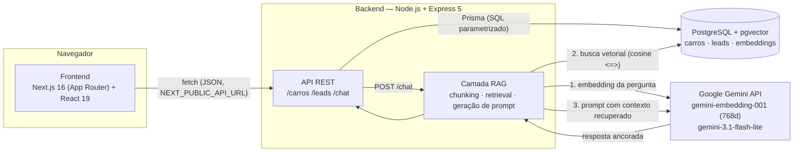

# AutoStore

Catálogo de carros full-stack com captura de leads e um assistente de IA ancorado nos dados reais do catálogo via RAG (Retrieval-Augmented Generation).

Projeto desenvolvido para o desafio de estágio dev full-stack (7 dias, monorepo, pitch final de 15 min).

---

## Visão geral

A AutoStore é uma loja de carros online. O visitante navega o catálogo, filtra por montadora/categoria/motorização/preço, abre o detalhe de um veículo, tira dúvidas com um assistente de IA que responde **apenas com base nos dados reais do catálogo** (nunca inventa preço, versão ou especificação) e deixa seus dados de contato vinculados a um carro específico. A equipe de vendas consulta os leads capturados numa tela dedicada e administra o catálogo (criar/editar/remover carros) num painel interno.

O problema que o projeto resolve: hoje, tirar dúvidas técnicas sobre um catálogo de carros (consumo, potência, comparações entre modelos) depende de um vendedor humano ou de vasculhar fichas técnicas dispersas. O assistente de IA com RAG resolve isso oferecendo respostas imediatas, precisas e **ancoradas nos dados reais** — com recusa explícita quando a pergunta foge do escopo da loja, em vez de alucinar uma resposta.

---

## Arquitetura



**Fluxo do chat, em detalhe:** a pergunta do usuário vira um embedding (`gemini-embedding-001`, `task_type=RETRIEVAL_QUERY`) → busca por similaridade de cosseno no pgvector entre os ~121 chunks já indexados da base técnica → os trechos mais relevantes (top-5) entram no prompt como `CONTEXTO` → o modelo de geração (`gemini-3.1-flash-lite`) responde **apenas** com base nesse contexto, com uma instrução de sistema separada (campo `systemInstruction` da API) que veta alucinação e tentativas de sobrescrever as regras via prompt injection.

A chave `GEMINI_API_KEY` existe **apenas no backend** (`backend/.env`, nunca commitada) — o frontend nunca a vê, nunca a recebe em nenhuma resposta de API.

---

## Stack

| Camada | Tecnologia |
| --- | --- |
| Frontend | Next.js 16 (App Router), React 19, TypeScript, Tailwind CSS v4 |
| Backend | Node.js 20, Express 5, TypeScript |
| ORM / Banco | Prisma 5, PostgreSQL + extensão **pgvector** |
| IA | Gemini `gemini-embedding-001` (embeddings, 768d) + `gemini-3.1-flash-lite` (geração) |
| Testes | Vitest + Supertest (backend), Vitest + React Testing Library (frontend), Playwright (E2E) |
| Segurança | `helmet`, `express-rate-limit`, CORS restrito, validação de payload em toda rota |

Repositório com histórico de commits incremental via feature branches + Pull Requests (43 commits, 21 PRs) — não um commit único no final.

---

## Setup do zero

Pré-requisitos: **Node.js ≥ 20.19**, **PostgreSQL com a extensão pgvector**, e uma **chave de API do Gemini** ([Google AI Studio](https://aistudio.google.com/apikey)).

### 1. Clone e instale as dependências

```bash
git clone <url-do-repositorio>
cd ContinetalMotors

cd backend && npm install
cd ../frontend && npm install
```

### 2. Banco de dados com pgvector

Se seu Postgres ainda não tem a extensão:

```bash
# Ubuntu/Debian — troque "16" pela sua versão do Postgres (psql --version)
sudo apt update && sudo apt install postgresql-16-pgvector
```

Ou via Docker, com tudo pronto:

```bash
docker run --name autostore-db \
  -e POSTGRES_PASSWORD=123 \
  -e POSTGRES_DB=continentalmotors \
  -p 5432:5432 -d pgvector/pgvector:pg16
```

### 3. Variáveis de ambiente

```bash
# backend
cd backend
cp .env.example .env
# edite .env: DATABASE_URL (aponte para o seu Postgres) e GEMINI_API_KEY (sua chave)

# frontend
cd ../frontend
cp .env.example .env
# valor padrão (http://localhost:3333) já funciona se o backend rodar na porta default
```

### 4. Migrations, seed e ingestão do RAG

Se você não usou o Docker acima (que já cria o banco), crie o banco vazio primeiro — o Prisma não faz isso sozinho:

```bash
createdb continentalmotors
# ou: psql -c "CREATE DATABASE continentalmotors;"
```

Depois, **nesta ordem**, a partir de `backend/`:

```bash
npx prisma migrate deploy   # cria as tabelas carros, leads, embeddings (+ extensão vector)
npx prisma generate         # gera o Prisma Client

npm run seed                # popula os 15 carros do catálogo
npm run rag:ingest          # gera os embeddings da base técnica e indexa no pgvector (~1min30s)
```

> Testei este exato fluxo (`migrate deploy` → `generate` → `seed`) contra um banco novo e vazio antes de escrever este README — funciona de ponta a ponta sem passos escondidos.

`rag:ingest` só precisa ser rodado **uma vez** — os embeddings ficam persistidos no Postgres e são reutilizados em toda consulta do chat (RNF03). Reexecutar é seguro (idempotente: `TRUNCATE` + reindexação completa), mas desnecessário a menos que a base técnica mude.

### 5. Subir os dois servidores

Em dois terminais separados:

```bash
# terminal 1
cd backend && npm run dev     # http://localhost:3333

# terminal 2
cd frontend && npm run dev    # http://localhost:3000
```

Abra `http://localhost:3000`. Pronto — catálogo, detalhe, chat, leads e admin funcionando.

---

## Roteiro de validação

Com os dois servidores no ar e o seed/ingestão já executados:

### 1. Catálogo (US01, RF01)

Abra `http://localhost:3000`. Devem aparecer **15 cards** de carros, cada um com foto, montadora, modelo, ano, potência, câmbio e preço.

Teste os filtros: busque por texto ("corolla"), filtre por montadora e por categoria, arraste o slider de preço, troque a ordenação para "Menor preço" — a lista deve reagir imediatamente, sem reload de página.

### 2. Detalhe (US02, RF02)

Clique em qualquer card. Deve abrir `/carros/[id]` com galeria de fotos, ficha técnica completa (motor, potência, câmbio, consumo, ano, categoria), cores disponíveis, preço e o formulário de lead.

### 3. Chat / RAG (US03, RF03, RF04)

Abra `/chat` e faça estas perguntas (todas testadas e confirmadas nesta validação):

| Pergunta | O que esperar |
| --- | --- |
| "Quais cores e qual o consumo do Corolla Cross?" | Cores exatas do catálogo + consumo em km/l |
| "Quanto custa o Corolla Cross?" | Preço a partir de R$ 170.790 |
| "Compare o Onix e o HB20 para uso urbano" | Comparação real, diferenciando os dois modelos |
| "Qual SUV elétrico ou híbrido você recomenda e por quê?" | Recomendação justificada (ex.: BYD Yuan Plus ou Corolla Cross) |
| "Quais modelos da Toyota existem no catálogo?" | Corolla, Corolla Cross, Hilux — só esses três |
| "Qual carro tem o menor preço inicial?" | Hyundai HB20, R$ 95.790 |
| "Vocês vendem motos?" | Recusa educada, sem inventar, redireciona ao catálogo |

Cada resposta vem acompanhada das **fontes** recuperadas (visível em "Fontes consultadas" no balão) — evidência de que a resposta foi ancorada em busca vetorial real, não em conhecimento genérico do modelo.

Quando a resposta aponta claramente para um único carro, aparece o botão "Tenho interesse no [carro]" — clique para abrir o formulário de lead direto do chat.

### 4. Captura de lead (US04, RF07)

No detalhe de um carro (ou pelo chat), preencha nome + e-mail (ou telefone) + mensagem opcional e envie. Deve aparecer a confirmação "Interesse registrado!".

### 5. Consulta de leads / persistência (US05, RF08)

Abra `/leads` — o lead que você acabou de criar deve aparecer na lista, com o carro vinculado. **Reinicie o backend** (`Ctrl+C` e `npm run dev` de novo) e recarregue `/leads`: o lead continua lá — confirma persistência real em Postgres, não memória.

### 6. Admin — CRUD visual

Abra `/admin/carros`. Crie um carro novo, edite um existente, remova um (se tentar remover um carro com lead vinculado, deve dar erro 409 claro, não travar).

### 7. Estados de erro/vazio (RNF06)

Derrube o backend (`Ctrl+C`) e recarregue `/` ou `/leads` — deve aparecer uma mensagem amigável de erro ("Não foi possível conectar ao servidor..."), nunca uma tela em branco ou um erro técnico cru. Suba o backend de novo e filtre a vitrine por algo que não existe (ex.: busque "zzz") — deve aparecer o estado "Nenhum carro corresponde aos filtros".

---

## Testes

```bash
# Backend (72 testes: unitários + integração, Prisma e Gemini mockados — não precisa de Postgres real)
cd backend && npm test

# Frontend (39 testes unitários/componente, API mockada)
cd frontend && npm test

# E2E — precisa do sistema real no ar (backend + frontend + Postgres com seed)
cd frontend && npm run test:e2e
```

Detalhes de cada suíte nos READMEs específicos ([backend](backend/README.md#testes), [frontend](frontend/README.md#testes)).

---

## Decisões técnicas e trade-offs (RNF07)

### pgvector em vez de um vector DB dedicado

O projeto já usa Postgres para `carros` e `leads`; adicionar Pinecone/Qdrant/Weaviate só para ~121 vetores introduziria infraestrutura sem benefício real de performance nessa escala. `pgvector` mantém tudo em um único banco, uma única conexão, um único backup.

### Chunking por seção, não por carro inteiro

Cada carro é dividido em seções (dados canônicos, contexto enriquecido, FAQ, trade-offs, palavras-chave) e cada seção vira um chunk independente, prefixado com o nome do carro. Um chunk único por carro diluiria a relevância em perguntas cirúrgicas ("qual o consumo do X?"); chunks por seção dão precisão sem perder a comparação entre carros — resolvida à parte (ver abaixo).

### Chunks comparativos sintéticos

Perguntas globais ("qual o mais barato?", "quais elétricos vocês têm?") não são respondidas bem por retrieval sobre fichas individuais — o retrieval teria que "adivinhar" que precisa juntar 15 chunks diferentes. Em vez disso, o script de ingestão gera chunks derivados do catálogo estruturado (ranking de preço, agrupamento por categoria/montadora, lista de elétricos) e indexa junto com a base técnica. Isso ancora diretamente as perguntas comparativas do desafio.

### Embeddings em 768 dimensões, com normalização manual

`gemini-embedding-001` gera 3072 dimensões por padrão; usamos o truncamento nativo (Matryoshka) para 768, com perda de qualidade desprezível e 1/4 do espaço de armazenamento/índice. Diferente da dimensão padrão (3072), embeddings truncados **não vêm normalizados automaticamente** pela API — o cliente aplica normalização L2 manualmente, requisito para a distância de cosseno do pgvector (`<=>`) funcionar corretamente.

### `task_type` assimétrico

Documentos indexados usam `RETRIEVAL_DOCUMENT`; a pergunta do usuário usa `RETRIEVAL_QUERY`. É uma recomendação oficial do modelo de embedding do Gemini: pergunta e resposta não são semanticamente idênticas (uma é uma pergunta curta, outra é um texto descritivo), e usar o `task_type` certo para cada lado melhora a qualidade do retrieval de forma mensurável.

### Anti-alucinação

Temperatura de geração baixa (0.2) + instrução de sistema explícita para responder **apenas** com base no contexto recuperado, admitindo desconhecimento em vez de inventar. Testado ao vivo: perguntar sobre motos faz o assistente recusar educadamente, sem inventar um produto que não existe no catálogo.

### Memória de conversa (histórico)

O frontend envia as últimas mensagens da conversa a cada pergunta nova; o backend detecta perguntas de acompanhamento (frases curtas ou com pronomes como "ele"/"esse"/"mais detalhes") e enriquece a busca vetorial combinando a pergunta atual com a última pergunta do usuário — sem isso, "e o consumo dele?" sozinho não recuperaria nada relevante.

### Filtros da vitrine derivados dos dados, não hardcoded

Montadora, categoria e motorização (esta última inferida do texto livre do campo `motor`) são calculados a partir do catálogo já carregado, não de uma lista fixa no código — um carro novo cadastrado via admin com uma categoria inédita aparece automaticamente como opção de filtro.

### Segurança da chave e do prompt

Auditoria dedicada confirmou: `.env` nunca foi commitado (verificado em todo o histórico de commits, não só no estado atual), `GEMINI_API_KEY` só existe em código do backend. A instrução de sistema do RAG vai no campo `systemInstruction` da API do Gemini — estruturalmente separado do conteúdo do usuário — reduzindo a superfície de prompt injection. `/chat` tem rate limiting (10 req/min/IP) contra abuso de cota paga. Detalhe completo em [`backend/README.md`](backend/README.md#hardening-de-segurança).

### O que ficou de fora, deliberadamente

- **Busca híbrida (BM25 + vetorial)**: o desafio marca como opcional/bônus, não obrigatório. Não implementada por prioridade de tempo (7 dias) em favor de robustecer o retrieval vetorial, o fluxo de lead e a cobertura de testes.
- **Autenticação em `/admin` e na listagem de leads**: fora do escopo funcional do desafio. Documentado explicitamente no código (comentário no topo de cada arquivo de rota administrativa) e na auditoria de segurança — não é um descuido, é uma linha de escopo consciente.
- **Upload de imagem**: o cadastro de carro usa caminho/URL de imagem como texto, não upload de arquivo — evita a complexidade de armazenamento de blob/CDN fora do escopo do desafio.

---

## Limitações conhecidas

- **Sem autenticação** em `/admin/*` e `GET /leads` — qualquer pessoa com acesso à URL pode gerenciar o catálogo e ler os leads capturados. Aceitável para o contexto do desafio (ambiente local/demo), mas **não deve ir para produção real sem um sistema de login**.
- **Tier gratuito do Gemini**: 100 requisições de embedding por minuto — a ingestão inicial já é calibrada para isso (pausa de 700ms entre chamadas), mas uma base técnica muito maior exigiria ajuste.
- **Prompt injection**: mitigado (separação estrutural de instrução/dado + regra explícita), mas não eliminado — nenhuma técnica atual de prompt engineering garante imunidade total. O impacto real é limitado porque o chat só faz leitura (RAG), sem acesso a ferramentas ou ao banco.
- **BM25/busca lexical**: não implementada (ver "o que ficou de fora").
- **2 vulnerabilidades moderadas do `npm audit`** no frontend (`postcss`, transitiva via `next`) — não exploráveis neste projeto (exigiriam CSS não confiável processado em runtime, que não existe aqui); corrigi-las forçaria downgrade do Next em 7 versões majors. Documentado e aceito conscientemente.

## Próximos passos (se o projeto continuasse)

- Autenticação real (sessão ou JWT) para `/admin` e `/leads`, com papéis (admin vs. vendedor).
- Busca híbrida (BM25 + vetorial) para reforçar recall em perguntas com termos muito específicos (nomes de peças, siglas).
- Upload de imagem real (S3/Cloudinary) no cadastro de carro, em vez de caminho/URL manual.
- Paginação no catálogo e na listagem de leads, hoje dimensionada para o volume do desafio (15 carros).

---

## Estrutura do monorepo

```
ContinetalMotors/
├── backend/    → API REST, RAG, Prisma/Postgres — ver backend/README.md
├── frontend/   → Next.js App Router — ver frontend/README.md
└── README.md   → este arquivo
```

Documentação detalhada de cada camada: **[backend/README.md](backend/README.md)** · **[frontend/README.md](frontend/README.md)**
